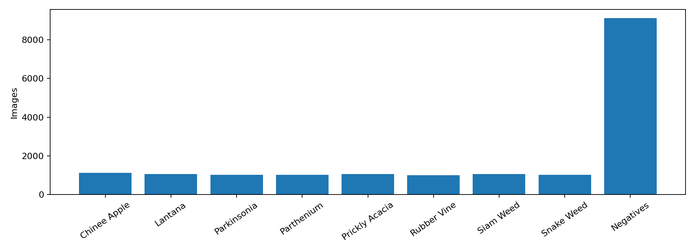
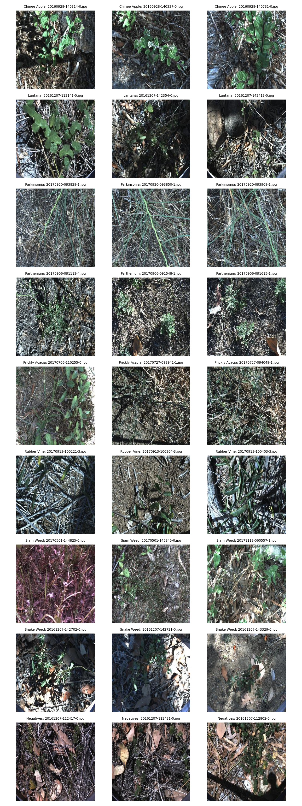
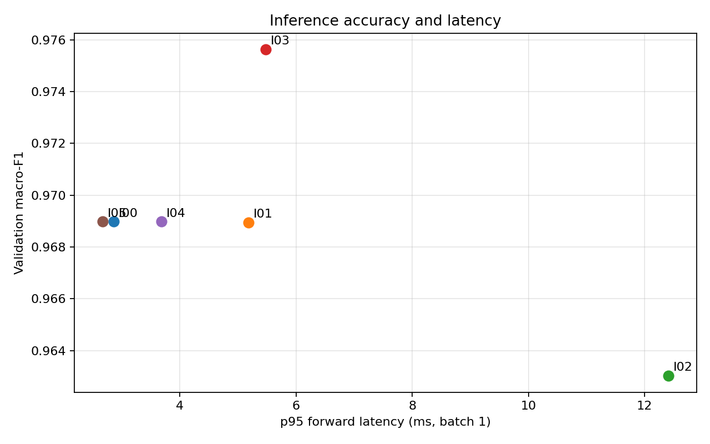
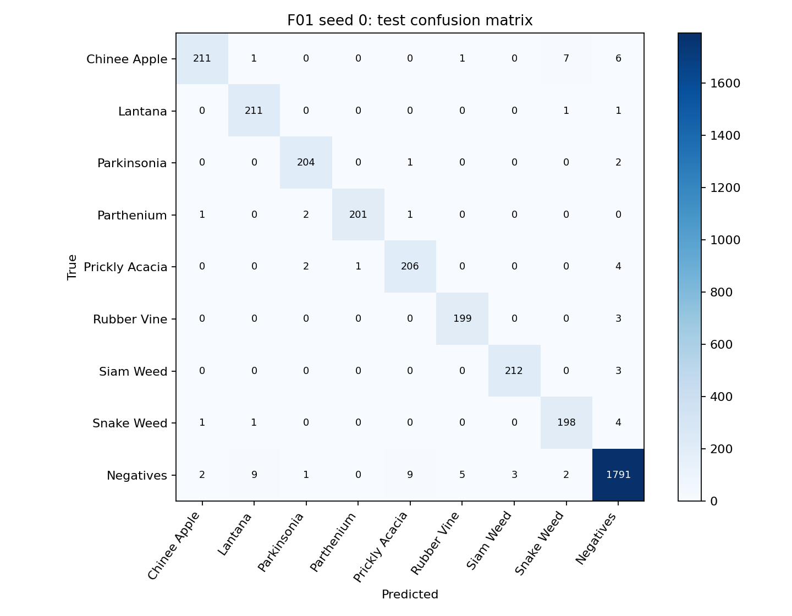
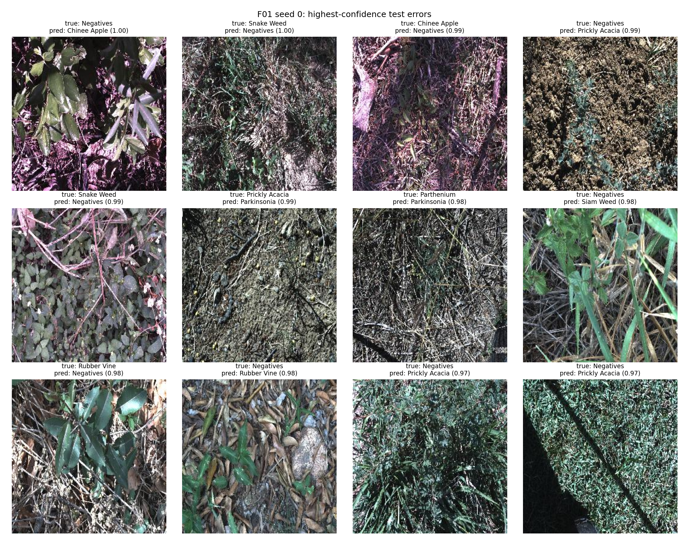

# Báo cáo DeepWeeds Day 2

## 1. Tóm tắt

Đã chạy 5 backbone, 12 công thức huấn luyện và 6 phương pháp suy luận trên fold 0. Chọn B03 + I03 bằng validation, rồi huấn luyện lại F01 và T00 với ba seed. F01 đạt macro-F1 test 0.9781 ± 0.0041, top-1 0.9824 ± 0.0031. So với T00, Δ macro-F1 = +0.1389. Chênh lệch lớn hơn độ lệch chuẩn lớn nhất giữa hai nhóm seed.

## 2. Dữ liệu và thiết lập

DeepWeeds gồm 17,509 ảnh, fold 0: train 10,501, val 3,501, test 3,507; giao giữa các tập bằng 0. Nhãn train/val/test lấy theo CSV fold 0 của tác giả. Chỉ dùng val để chọn mô hình, công thức, checkpoint và suy luận. Test được đánh giá một lượt cho mỗi seed sau khi chốt lựa chọn. Có 1 ảnh có nhãn khác giữa labels.csv và CSV fold 0; bài làm giữ nguyên nhãn của CSV fold 0.

Baseline: resnet50, ImageNet pretrained (timm/resnet50.a1_in1k), 12 epoch, batch 32, ảnh 224 px, AdamW, LR backbone 0.0001, head 0.001, weight decay 0.05, warmup 1.0 epoch rồi cosine; seed 0/1/2. Thiết bị cuối: NVIDIA GeForce RTX 4090; PyTorch 2.9.0+cu126, timm 1.0.20. Chỉ số tính bằng eval.py gốc; ECE dùng 15 bin; std mẫu ddof=1.

Lớp Negatives có 9,106 ảnh, chiếm 52.0%; các lớp cây có 1,009–1,125 ảnh/lớp. Phân bố này khớp số lượng trong Table 1 của bài báo và giải thích vì sao báo cáo thêm macro-F1, recall từng lớp.

Kiểm pipeline: CE lý thuyết ln 9 = 2.1972; loss head ban đầu 2.2699, sau overfit một batch còn 0.000688; sai khác Focal γ=0 với CE là 0.00e+00. Ảnh kiểm augmentation và CutMix ở `curves/sanity_augmented.png` và `curves/sanity_cutmix.png`.

## 3. So sánh backbone trên val

| ID | Backbone | Tag | Params M | GMAC thop | Macro-F1 val | Top-1 val | s/epoch | p95 ms |
|---|---|---|---|---|---|---|---|---|
| B01 | resnet50 | timm/resnet50.a1_in1k | 23.53 | 4.13 | 0.8277 | 0.8726 | 12.3 | 2.23 |
| B02 | resnext50_32x4d | timm/resnext50_32x4d.a1h_in1k | 23.00 | 4.29 | 0.8469 | 0.8806 | 14.4 | 1.89 |
| B03 | convnext_tiny | timm/convnext_tiny.in12k_ft_in1k | 27.83 | 4.45 | 0.9690 | 0.9763 | 14.7 | 1.98 |
| B04 | deit_small_patch16_224 | timm/deit_small_patch16_224.fb_in1k | 21.67 | 4.24 | 0.9516 | 0.9652 | 10.0 | 2.72 |
| B05 | efficientnet_b0 | timm/efficientnet_b0.ra_in1k | 4.02 | 0.38 | 0.8313 | 0.8723 | 9.8 | 1.79 |

Trong năm backbone, B03 có macro-F1 val cao nhất (0.9690) ở seed 0.

Cùng fold 0, seed 0 và công thức nền. GMAC do thop ước tính; xem riêng độ trễ đo trên GPU trong results.xlsx. Các chênh lệch ở bước sàng lọc này chỉ dựa trên một seed.

## 4. Công thức huấn luyện trên val

| ID | Thay đổi so với T00 | Macro-F1 val | Δ với B01 |
|---|---|---|---|
| T01 | {'init': 'scratch'} | 0.5275 | -0.3003 |
| T02 | {'init': 'frozen'} | 0.6555 | -0.1723 |
| T03 | {'aug': 'color'} | 0.8018 | -0.0259 |
| T04 | {'aug': 'randaug'} | 0.8438 | +0.0161 |
| T05 | {'loss': 'ls', 'label_smoothing': 0.1} | 0.8336 | +0.0058 |
| T06 | {'loss': 'focal', 'focal_gamma': 2.0} | 0.8233 | -0.0044 |
| T07 | {'loss': 'ce_weighted'} | 0.8019 | -0.0258 |
| T08 | {'sampler': 'balanced'} | 0.7959 | -0.0318 |
| T09 | {'mix': 'mixup'} | 0.7954 | -0.0323 |
| T10 | {'mix': 'cutmix'} | 0.8164 | -0.0114 |
| T11 | {'ema_decay': 0.999} | 0.8221 | -0.0056 |
| T12 | {'aug': 'randaug', 'loss': 'ls', 'label_smoothing': 0.1} | 0.8525 | +0.0248 |

Trong các công thức đơn lẻ, T04 có macro-F1 val cao nhất (0.8438); B01 đạt 0.8277. Đây là so sánh seed 0.

Mỗi T01–T11 thay một yếu tố so với B01/T00; T12 kết hợp augmentation và loss chọn bằng val. Các Δ này là kết quả một seed, chưa đủ để kết luận hiệu quả ổn định khi chênh lệch nhỏ.

T12 kết hợp T04 và T05: macro-F1 val 0.8525, chênh +0.0087 so với thành phần đơn lẻ tốt hơn. Đây là một seed; chưa thể khẳng định hai yếu tố cộng dồn nếu chênh lệch nhỏ.

Đường cong B01 nằm ở `curves/B01_seed0.png`; checkpoint tốt nhất ở epoch 11. Đường cong T04 nằm ở `curves/T04_seed0.png`, checkpoint tốt nhất ở epoch 11. So sánh loss train/val trên các đường cong để nhận diện hội tụ và quá khớp; giá trị từng epoch nằm trong log.

## 5. Suy luận và chi phí

| ID | Views | Macro-F1 val | ECE val | p50 ms | p95 ms | p99 ms |
|---|---|---|---|---|---|---|
| I00 | 1 | 0.9690 | 0.0103 | 1.88 | 2.86 | 3.13 |
| I01 | 2 | 0.9689 | 0.0083 | 3.53 | 5.18 | 5.54 |
| I02 | 6 | 0.9630 | 0.0153 | 9.77 | 12.41 | 14.00 |
| I03 | 2 | 0.9756 | 0.0069 | 3.52 | 5.48 | 5.80 |
| I04 | 1 | 0.9690 | 0.0046 | 1.71 | 3.68 | 3.85 |
| I05 | 1 | 0.9690 | 0.0103 | 1.75 | 2.67 | 2.80 |

Các phép đo trên NVIDIA GeForce RTX 4090, batch 1, FP32, 10 warmup và 100 lần đo, đồng bộ CUDA khi dùng GPU; phạm vi chỉ gồm forward với đầu vào tổng hợp. Thông lượng và độ trễ theo batch khác có trong results.xlsx. Chọn I03 trên val: macro-F1 0.9756, ECE 0.0069, p95 5.48 ms. Temperature scaling đổi ECE val từ 0.0103 sang 0.0046; macro-F1 đổi từ 0.9690 sang 0.9690. F01 dùng I03, không dùng temperature scaling trên test; vì vậy I4(a) của eval.py không được chấm. Với giới hạn p95 30 ms trên thiết bị đo, I03 có macro-F1 val 0.9756 và p95 5.48 ms. Với giới hạn p95 100 ms trên thiết bị đo, I03 có macro-F1 val 0.9756 và p95 5.48 ms. Chỉ đo forward; cần đo cả pipeline trước khi chọn phương án triển khai thực tế.

## 6. Chung kết trên test

Cấu hình F01: `{"backbone": "convnext_tiny", "init": "finetune", "aug": "basic", "loss": "ce", "sampler": null, "mix": null, "ema_decay": null, "epochs": 12, "batch_size": 32, "img_size": 224, "lr_backbone": 0.0001, "lr_head": 0.001, "weight_decay": 0.05, "final_inference": "I03"}`.

| ID | Seed | Macro-F1 val | Macro-F1 test | Top-1 test | ECE test |
|---|---|---|---|---|---|
| T00 | 0 | 0.8277 | 0.8331 | 0.8765 | 0.0122 |
| T00 | 1 | 0.8274 | 0.8465 | 0.8842 | 0.0206 |
| T00 | 2 | 0.8307 | 0.8380 | 0.8797 | 0.0245 |
| T00 | mean ± std | — | 0.8392 ± 0.0068 | 0.8801 ± 0.0039 | 0.0191 ± 0.0063 |
| F01 | 0 | 0.9756 | 0.9738 | 0.9789 | 0.0082 |
| F01 | 1 | 0.9744 | 0.9819 | 0.9849 | 0.0054 |
| F01 | 2 | 0.9741 | 0.9786 | 0.9835 | 0.0073 |
| F01 | mean ± std | — | 0.9781 ± 0.0041 | 0.9824 ± 0.0031 | 0.0070 ± 0.0014 |

Mốc T00 macro-F1 test 0.8392 ± 0.0068; F01 cải thiện +0.1389. Chênh lệch lớn hơn độ lệch chuẩn lớn nhất giữa hai nhóm seed.

| Lớp | Ảnh test | Precision F01 | Recall F01 | F1 F01 |
|---|---|---|---|---|
| Chinee Apple | 226 | 0.977 ± 0.008 | 0.953 ± 0.018 | 0.965 ± 0.010 |
| Lantana | 213 | 0.968 ± 0.015 | 0.989 ± 0.003 | 0.978 ± 0.007 |
| Parkinsonia | 207 | 0.982 ± 0.005 | 0.986 ± 0.000 | 0.984 ± 0.003 |
| Parthenium | 205 | 0.998 ± 0.003 | 0.982 ± 0.003 | 0.990 ± 0.002 |
| Prickly Acacia | 213 | 0.954 ± 0.005 | 0.970 ± 0.005 | 0.962 ± 0.005 |
| Rubber Vine | 202 | 0.985 ± 0.013 | 0.980 ± 0.005 | 0.983 ± 0.004 |
| Siam Weed | 215 | 0.992 ± 0.005 | 0.989 ± 0.005 | 0.991 ± 0.005 |
| Snake Weed | 204 | 0.964 ± 0.012 | 0.961 ± 0.010 | 0.962 ± 0.005 |
| Negatives | 1822 | 0.987 ± 0.000 | 0.988 ± 0.005 | 0.988 ± 0.002 |

Ma trận nhầm lẫn dưới đây thuộc F01 seed 0 (hàng là nhãn thật, cột là nhãn dự đoán). Các cặp nhầm nhiều nhất của seed này: Negatives → Prickly Acacia: 9 ảnh; Negatives → Lantana: 9 ảnh; Chinee Apple → Snake Weed: 7 ảnh; Chinee Apple → Negatives: 6 ảnh; Negatives → Rubber Vine: 5 ảnh. Riêng Chinee Apple → Snake Weed: 7 ảnh; Snake Weed → Chinee Apple: 1 ảnh. Giả thuyết cần kiểm thêm: hình dạng lá, nền và điều kiện chiếu sáng tương tự có thể làm hai lớp khó phân biệt; ảnh lỗi bên dưới chỉ minh họa, chưa chứng minh nguyên nhân.

Ảnh dưới đây là tối đa 12 lỗi test có độ tin cậy dự đoán sai cao nhất của F01 seed 0. Chúng minh họa kiểu lỗi; không dùng để chỉnh mô hình sau khi xem test.

## 7. Kết luận và hạn chế

Cấu hình được chọn bằng val là B03 + I03. Mức cải thiện test so với baseline là +0.1389 macro-F1. Chênh lệch lớn hơn độ lệch chuẩn lớn nhất giữa hai nhóm seed. Trên val seed 0, backbone cao nhất hơn B01 +0.1412, công thức đơn lẻ cao nhất hơn B01 +0.0161, và phương pháp suy luận đã chọn đổi macro-F1 so với I00 trên cùng nguồn +0.0066. Ba chênh lệch này thuộc các phép sàng lọc khác nhau, không cộng lại thành đóng góp nhân quả. Không dùng test để chọn lại cấu hình.

Nghiên cứu chỉ dùng fold 0 và ba seed ở chung kết. Các thí nghiệm sàng lọc dùng một seed. Fold của DeepWeeds không tách theo địa điểm hoặc mùa, nên điểm test có thể lạc quan khi triển khai ngoài miền dữ liệu. Độ trễ forward với ảnh tổng hợp chưa bao gồm đọc ảnh, tiền xử lý hay truyền dữ liệu; cần đo toàn pipeline trên robot trước khi triển khai.

## 8. Tái lập

Cấu hình, tag trọng số, phiên bản và lịch sử epoch nằm trong `logs/<exp_id>/seed<k>/` của bài nộp; checkpoint được giữ tại `runs/<exp_id>/seed<k>/` trên server, không đưa lên Git. File dự đoán `predictions/F01_seed*_test.csv` và `predictions/T00_seed*_test.csv` là đầu vào trực tiếp cho `eval.py score`/`grade`. Notebook: `code/lab_day2.ipynb`; link Colab trực tiếp nằm trong README. Danh sách tất cả cấu hình có trong `results.xlsx` và `logs/`; đầu ra `eval.py score`/`grade` nằm trong `evaluation/`.
